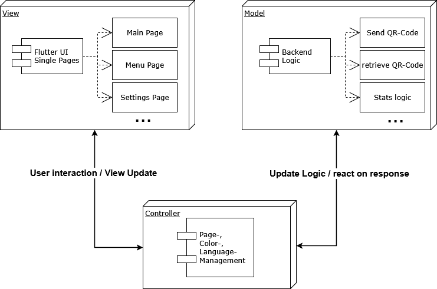

# ToDo-List Prior (TLP)

**ToDo-List Prior (TLP)** ist eine intelligente ToDo-App mit Fokus auf *automatischer Priorisierung*. Sie richtet sich an alle, die ihre Aufgaben strukturiert, effizient und fokussiert erledigen wollen – ohne sich mühsam durch endlose ToDo-Listen zu klicken.  

**Die .apk-Datei zur direkten Installation liegt hier im Stammverzeichnis bereit!**  
Einfach installieren, loslegen – alle Funktionen sind sofort nutzbar.

---

## App-Beschreibung

Die App bietet:
- Klassische ToDo-Verwaltung mit Aufgaben, Deadlines, Prioritäten
- **Automatische Sortierung** nach unterschiedlichen Methoden
- **5 integrierte Priorisierungsprinzipien**:
  - Earliest Due Day  
  - Duration & Deadline  
  - Eisenhower Matrix  
  - Value vs Effort  
  - Individuelles, gewichtetes Scoring-Modell
- **Eigenes Regelwerk definieren:** Nutze deine individuelle Gewichtung aus *Priorität*, *Dauer* und *Deadline* – flexibel, aber strukturiert!

---

## Installation & Setup

### APK-Datei
Die `TLP_release.apk` befindet sich direkt im Stammverzeichnis folder.  
**Installation auf einem Android-Gerät genügt, um die App in vollem Funktionsumfang zu nutzen**.

### Projekt selbst clonen?
Falls du das Projekt clonen und lokal ausführen willst:
- Ein gültiger **Magenta Cloud Token** ist erforderlich, um QR-basierte Datenübertragung zu nutzen (bspw. für Geräte-Sync).
- Ohne Token läuft die App, aber die QR-Funktionalität ist **deaktiviert**.
- Lege dafür eine **magenta_cloud_token** Datei im Unterverzeichnis **src/lib/config/** an und schreibe dein Individuelles Token rein.
- Lege außerdem eine DB.csv Datei innerhalb deiner Magentacloud an.

---

## Projektstruktur & Architektur

Die App folgt dem **MVC-Pattern** (Model-View-Controller), um Wartbarkeit, Erweiterbarkeit und Trennung von Logik und UI sicherzustellen.

## Lines of Code (LoC)

Analyse via 'cloc'

| Language | Files | Blank | Comment | Code |
|----------|-------|-------|---------|------|
| Dart     | 46    | 597   | 246     | 4599 |
| JSON     | 1     | 0     | 0       | 1298 |
| **SUM:** | 47    | 597   | 246     | 5897 |
